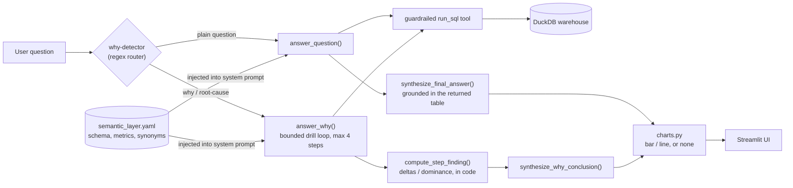

# Autonomous Analyst

Autonomous Analyst — an agentic text-to-SQL system that answers business questions over an
Indian e-commerce warehouse, with a semantic layer, guardrails, honest root-cause drill-down,
and a measured evaluation.

**Live demo:** [DEMO_URL] — runs on local Ollama 7B in dev, Groq Llama-3.3-70B in the hosted
demo, swapped via 3 env vars (the LLM client is provider-agnostic by design; see
[Setup / running it](#setup--running-it)).


## What it does

Ask a plain question about the warehouse (orders, order line items, monthly sales targets) and
it validates and runs a single guardrailed DuckDB query, then shows the natural-language answer,
the SQL it ran, the result table, and a chart if the shape supports one (bar or time-series
line).

Ask a **"why"** question — anything phrased as a cause ("why", "what caused", "what's driving",
"driver of", "root cause", "explain the drop/rise") — and it instead runs a **bounded, multi-step
root-cause drill-down**: it breaks the metric down by successive dimensions, computes deltas and
dominance in code (never trusting the model to eyeball a table), and shows the full reasoning
trace — step, reason, SQL, finding — before the conclusion. If no dimension actually explains the
change, it says so plainly rather than manufacturing a clean story.

## Architecture



- **Semantic layer** (`src/semantic_layer.yaml`): tables, columns, relationships, metric
  definitions, synonyms — injected verbatim into the system prompt so the model works from a
  fixed vocabulary instead of guessing the schema or re-deriving metric formulas.
- **Agent** (`src/agent.py`): a single-tool (`run_sql`) tool-calling loop over an
  OpenAI-compatible chat completions API. `answer_question()` is the single-shot path;
  `answer_why()` is a separate, bounded drill-down loop over the same guardrailed tool — it does
  not fork or weaken any guardrail.
- **Synthesis**: a dedicated, separate LLM call writes the final natural-language answer strictly
  from the actual returned table (or, for `answer_why()`, from the drill steps' code-computed
  findings) — never from conversation history, never inventing a number.
- **Charts** (`src/charts.py`): a presentation layer over already-computed results. Builds a
  chart spec from the exact rows already returned (never runs new SQL) and renders it with
  matplotlib; picks bar, line, or no chart depending on shape.
- **UI** (`src/app.py`): a thin Streamlit front over the above — no reasoning logic in the UI.
- **Eval harness** (`src/eval/`): execution-accuracy comparison against hand-verified gold SQL.
- **Warehouse**: DuckDB, built from the Ben Roshan Indian e-commerce CSVs (CC0) — `orders`,
  `order_items`, `sales_targets`.

## Guardrails

The agent's only tool, `run_sql`, is guarded so it can only ever run one read-only query:

- Physically read-only DuckDB connection (`duckdb.connect(..., read_only=True)`) — not just
  prompt-instructed.
- Single statement only — rejects `;`-separated queries.
- `SELECT` / `WITH` only — blocklist on
  `INSERT/UPDATE/DELETE/DROP/ALTER/CREATE/ATTACH/COPY/PRAGMA/INSTALL/LOAD`.
- Auto-appends `LIMIT 1000` if missing; hard row cap at 1000 regardless.
- 10-second timeout via a cancellable worker thread.
- 3-attempt self-correct retry loop on SQL errors, then fails gracefully instead of hanging.
- `customer_name` (PII) is stripped from every result before it reaches the model or the display.
- Basic prompt-injection phrases in the user's question ("ignore previous instructions", "reveal
  your system prompt", etc.) are refused before any LLM call is made.

## The eval story

Execution-accuracy eval on a 15-question hand-built set (4 easy / 6 medium / 5 hard), each with
hand-verified gold DuckDB SQL. For every question: run the agent single-shot, run the gold SQL
directly, compare result sets as an unordered, normalized set — strict on column shape (an extra
column beyond what's asked is a fail, on purpose: an honest ruler is the point). Temperature 0,
seed 0.

**Local `qwen2.5-coder:7b` via Ollama, three runs, each jump tied to a named fix:**

| run | accuracy | what changed |
|---|---|---|
| baseline | 10/15 (66.7%) | — |
| after [`ebba134`](https://github.com/saiteja9010/agentic-analyst/commit/ebba134) | 13/15 (86.7%) | aggregation-grain SQL rules + few-shot examples (order-level metrics, `HAVING` vs row-level `WHERE`, window-rank + outer filter for top-N-per-group, no `LIMIT` on trend queries) and a fix for a `<`/`>`/`&` unicode/HTML-escaping bug that was silently breaking any SQL with a comparison operator |
| after [`09c3174`](https://github.com/saiteja9010/agentic-analyst/commit/09c3174) | **14/15 (93.3%)** | a "return only the columns the question asks for" rule + generic few-shot, plus `seed=0` pinned in eval runs for determinism |

The one remaining miss (`qwen2.5-coder:7b` only): *"Which category-months missed their sales
target?"* — the agent's SQL returns exactly the right 20 rows and exactly the right values, but
adds one extra derived `missed_target` boolean column beyond what the gold query selects. A shape
mismatch, not a content error — kept as a fail anyway, because loosening the harness the moment
it catches something would defeat the point of having one.

**Groq `llama-3.3-70b-versatile`, same harness, same questions, only the env vars changed:**

**15/15 (100.0%)** — including the question the 7B always missed (it wrote exactly the columns
the gold query asks for, no more).

Both runs are committed as evidence, not just claimed: [`src/eval/report_ollama.json`](src/eval/report_ollama.json)
(14/15) and [`src/eval/report_groq.json`](src/eval/report_groq.json) (15/15).

## Root-cause drill-down

`answer_why()` is a separate, bounded mode — it does not modify or weaken any guardrail from the
single-shot path. Up to 4 steps; each step the model states a one-line reason and a breakdown
SQL query (the *full* grouped result, never a top-1 `LIMIT` — enforced in code, not just asked
for). After every step, `compute_step_finding()` computes in code the largest-magnitude row per
numeric column and its share of the column's total, plus (for a period-labelled breakdown) the
single largest period-over-period swing. A share ≥40% of a breakdown's total magnitude counts as
an isolated driver and stops the loop early; SQL errors are fed back into the next step so the
model can self-correct instead of the whole drill aborting.

Every claim in the final conclusion has to trace to a step that actually ran that turn — no
number is invented, and if the loop runs out its 4 steps without isolating a driver, it says so
instead of manufacturing a clean story. Real example, `"Which month drove the biggest revenue
change and why?"`:

```
Step 1: Identify the month with the biggest revenue change to understand the overall trend.
  SQL: SELECT month_key, SUM(amount) AS total_revenue FROM order_items GROUP BY month_key ...
  -> error: Binder Error: Referenced column "month_key" not found in FROM clause!
Step 2: (self-corrected: added the orders JOIN)
  -> normalized: the model's SQL had a LIMIT clause; it was stripped so the full grouped
     breakdown ran instead of a top-N subset
  -> 12 rows returned
  -> time_series swing in 'total_revenue': 2018-12 (37,579) -> 2019-01 (61,439),
     delta=23,860 (63.5%), swing_share=16.9% of total movement
  -> extreme=2019-01 (61,439) at 14.2% of total -- no dominant driver
Step 3: Break the Dec 2018 / Jan 2019 period down by category.
  -> 6 rows returned -> extreme=Electronics (26,716) at 27.0% -- no dominant driver
Step 4: Break Electronics down by sub-category for the same period.
  -> 8 rows returned -> extreme=Printers (10,867) at 24.0% -- no dominant driver

CONCLUSION: No single dimension dominates the revenue change between December 2018 and
January 2019. The biggest revenue increase occurred in January 2019 compared to December 2018,
with a 63.5% increase. Within the Electronics category, the sub-category of Printers saw the
most significant increase, with a 24.0% share of the total revenue.
```

Every number above — the swing, the shares, the SQL error and its self-correction — is real
output from a live run, not illustrative text; reproduce it with `python src/eval/run_why.py`.

## Honest limitations

- **`qwen2.5-coder:7b` via Ollama advertises tool-calling support but doesn't reliably populate
  it.** It instead emits a raw `{"name": "run_sql", "arguments": {...}}` JSON blob or a fenced
  ` ```sql``` ` block as plain text, so a fallback parser (`extract_fallback_tool_call()`)
  recovers either form. Groq's `llama-3.3-70b-versatile` emits proper structured tool calls
  natively — confirmed live during the provider swap, no fallback path needed at all.
- **Free-tier hosting note.** The hosted demo runs on a free Hugging Face Space and Groq's free
  API tier — expect a cold-start delay if the Space has been idle, and occasional slow or failed
  responses under Groq's free-tier rate limits.
- **The eval set is small and hand-built** — 15 questions across 3 difficulty tiers, not a large
  published benchmark. It's a real, reproducible signal on this schema, stated at that scope and
  no larger.

## Setup / running it

Needs Python 3.14 (the version this was built and tested against), and either a local
[Ollama](https://ollama.com) install or a [Groq](https://console.groq.com) API key.

```bash
git clone https://github.com/saiteja9010/agentic-analyst.git && cd agentic-analyst
python -m venv .venv && source .venv/bin/activate
pip install -r requirements.txt
cp .env.example .env
```

**Build the warehouse** (once, either path — place the raw Ben Roshan CSVs in `data/raw/`:
`List of Orders.csv`, `Order Details.csv`, `Sales target.csv`):

```bash
python src/ingest.py
```

**Option A — local Ollama (dev default):**

```bash
ollama pull qwen2.5-coder:7b
ollama serve   # if not already running
# .env's default block already targets this -- LLM_BASE_URL=http://localhost:11434/v1
```

**Option B — Groq (hosted/demo path):** edit `.env`, uncomment the Groq block, set
`LLM_API_KEY` to your own key:

```bash
LLM_BASE_URL=https://api.groq.com/openai/v1
LLM_MODEL=llama-3.3-70b-versatile
LLM_API_KEY=gsk_your_own_key   # keep this in .env, gitignored -- never commit it
```

**Run it:**

```bash
streamlit run src/app.py     # UI
python src/agent.py           # or: plain REPL
python src/eval/run_eval.py   # execution-accuracy eval (writes report.json, gitignored --
                               # copy it to report_<provider>.json to update a checked-in snapshot)
python src/eval/run_why.py    # prints the two demo root-cause traces end to end
```

Secrets (API keys) only ever live in `.env`, which is gitignored — `.env.example` is the
committed template with placeholder values.

### Deploying your own Space

The live demo above runs on a free [Hugging Face Space](https://huggingface.co/spaces) (Streamlit
SDK) against Groq. To deploy your own:

1. Create a new Space — SDK: **Streamlit**, hardware: free CPU basic. This repo's own
   `README.md` already carries the required Spaces YAML frontmatter at the very top
   (`sdk: streamlit`, `app_file: src/app.py`, ...), so no separate Space-side README needs to be
   hand-written.
2. Push this repo's contents to the Space's git remote (or link the Space to sync from this
   GitHub repo, from the Space's Settings page).
3. In the Space's **Settings → Repository secrets**, set `LLM_BASE_URL`, `LLM_MODEL`, and
   `LLM_API_KEY` (e.g. the Groq values from Option B above) — the Space never gets a `.env` file,
   so these three env vars are how it configures the same provider-agnostic client used locally.
4. Nothing else to build by hand: `data/raw/*.csv` are committed (small, public Ben Roshan data,
   ~90KB total), and `src/app.py` calls `ingest.py` automatically on cold start whenever
   `data/warehouse.duckdb` is missing — which it always is on a fresh Space checkout, since that
   file itself stays gitignored. First load after each Space (re)build is a few seconds slower
   for this one-time build; every load after that reuses the same warehouse file.
